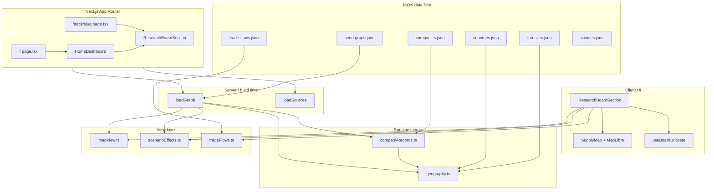

# Chip Sense — architecture

Chip Sense is a **Next.js 15 research board** for visualizing the semiconductor supply chain: companies, fabs, relationship arcs, trade flows, and illustrative stress scenarios on an interactive world map.

Data is **file-based** (JSON in `src/data/`). There is no database or API backend. The graph is assembled at runtime and rendered with **MapLibre** on the client.

---

## High-level flow



**Typical request path:**

1. Server pages call `loadGraph()` and `loadSources()`.
2. `loadGraph()` merges seed graph → company registry → geography (fabs, countries, presence pins).
3. `ResearchBoardSection` (client) filters via `buildMapView()`, computes scenario styling, syncs filters to the URL.
4. `SupplyMap` renders MapLibre markers, arcs, and trade lines.

---

## Three data layers

| Layer | Files | Role |
| --- | --- | --- |
| **Registry** (sourced facts) | `companies.json`, `fab-sites.json`, `sources.json` | HQ, fabs, citations |
| **Graph** (structure) | `seed-graph.json` + runtime merge | Nodes, edges, scenarios |
| **Illustrative** (stress-test) | `scenarios[].assumptions`, `scenarios[].affects` | Map styling only — not forecasts |

The map shows registry + graph. Scenarios **restyle** the same graph (chokepoint rings, disrupted arcs); they do not simulate capacity or shortages from numeric models.

---

## Directory layout

```
Chip Sense/
├── src/
│   ├── app/                 # Next.js App Router pages
│   ├── components/          # React UI (map, panels, board shell)
│   ├── data/                # JSON + TypeScript types
│   ├── hooks/               # Client hooks (URL state)
│   └── lib/                 # Graph merge, map filters, scenario logic
├── scripts/                 # Data validation + Comtrade fetch
├── docs/                    # Essay outline
├── ARCHITECTURE.md          # This file
├── MAP.md                   # Map rules, URL params, how to extend
├── SOURCES.md               # Sourcing rules
├── SCENARIOS.md             # Scenarios + writing prompts
├── COMPANIES.md             # Human company table
└── DATA_COVERAGE.md         # Auto-generated coverage (npm run data:coverage)
```

---

## App routes (`src/app/`)

| File | Route | Role |
| --- | --- | --- |
| `layout.tsx` | — | Root HTML shell, page metadata |
| `globals.css` | — | Theme CSS variables, MapLibre canvas sizing |
| `page.tsx` | `/` | Home — header, `HomeDashboard`, footer |
| `track/[slug]/page.tsx` | `/track/memory`, etc. | Track-specific board + research pointers |
| `not-found.tsx` | 404 | Not found page |

Server components load data; the interactive board runs client-side inside `Suspense`. `SupplyMap` is dynamically imported with `ssr: false` (MapLibre requires the browser).

---

## Components (`src/components/`)

| Component | Role |
| --- | --- |
| `HomeDashboard.tsx` | Reads `?track=` from URL; passes props to the board |
| `ResearchBoardSection.tsx` | **Main orchestrator** — map column, sidebar, sources strip |
| `SupplyMap.tsx` | MapLibre map: pins, supply/equip/pkg/memory/asm arcs, trade lines, layer toggles |
| `BoardSelectionPanel.tsx` | Sidebar detail when a node, edge, or trade flow is selected |
| `ScenarioImpactPanel.tsx` | Scenario description, assumptions, highlighted entities |
| `TradeFlowsPanel.tsx` | Comtrade flow list in sidebar |
| `EditorialTracksBar.tsx` | Links to `/track/*` (home page only) |
| `SourcesLinkedStrip.tsx` | Horizontal cited sources below the board |
| `ExportMapButton.tsx` | PNG export from map canvas |

---

## Hooks (`src/hooks/`)

| File | Role |
| --- | --- |
| `useBoardUrlState.ts` | Two-way sync between UI state and URL query params |

Shareable URL examples: `/?scenario=taiwan-crisis`, `/?track=gpus&trade=1`, `/?node=co-tsmc`.

See `MAP.md` for the full parameter list.

---

## Libraries (`src/lib/`)

| File | Role |
| --- | --- |
| `graphQueries.ts` | **`loadGraph()`** — primary graph entry point |
| `companyRecords.ts` | Merges `companies.json` into company nodes |
| `geography.ts` | Merges fab sites and countries; creates footprint / presence edges |
| `mapView.ts` | Filters nodes and edges for the map (track lens, essay-1, ops pins) |
| `scenarioEffects.ts` | Scenario map styling; bespoke logic for Taiwan + packaging scenarios |
| `boardUrlState.ts` | Parse and build URL query strings for board state |
| `tradeFlows.ts` | Trade JSON → GeoJSON, line width from USD or rank |
| `sourceQueries.ts` | Load sources catalog; resolve IDs from edges |
| `segments.ts` | Company segment → map pin color |
| `companySourceIds.ts` | Company ID → citation ID for footprint edges |

### `loadGraph()` merge order

```
seed-graph.json
  → applyCompanyRecords()   # companies.json → company node meta
  → applyGeography()        # fab-sites.json, countries.json, presence pins, edges
```

---

## Data files (`src/data/`)

| File | Role |
| --- | --- |
| `graph.ts` | TypeScript types: `GraphNode`, `GraphEdge`, `Scenario`, etc. |
| `tracks.ts` | Editorial track definitions (slug, title, colors, research pointers) |
| `seed-graph.json` | Core seed: nodes, edges, scenarios |
| `companies.json` | Company registry (HQ, segment, sourcing URLs) |
| `fab-sites.json` | Fab/site pins with coordinates and `source_ids` |
| `countries.json` | Country centroids |
| `sources.json` | Citation catalog |
| `trade-flows.json` | Country-pair trade flows (Comtrade + documented overrides) |

### Node kinds

`company`, `fab`, `presence`, `country`, `product_category`, `end_market`

Only nodes with coordinates appear on the map (`company`, `fab`, `country`, `presence`).

### Edge kinds (map-relevant)

| Kind | Map layer | Meaning |
| --- | --- | --- |
| `supplies` | Foundry supply | Foundry → fabless/IDM |
| `equips` | Equipment | Tool vendor → fab operator |
| `packages` | Packaging | OSAT → customer |
| `memory_supply` | HBM / memory | Memory maker → accelerator |
| `assembles` | Assembly | EMS → brand |
| (trade JSON) | Trade flows | Country → country (Comtrade) |

Structural edges (`hq_in`, `operates`, `located_in`, `operates_in`) support geography and sidebar detail but are not drawn as HQ arcs.

---

## Scripts (`scripts/`)

| Script | npm command | Role |
| --- | --- | --- |
| `validate-companies.mjs` | `validate:companies` | Registry completeness and sourcing |
| `validate-sources.mjs` | `validate:sources` | `source_ids` resolve to catalog |
| `validate-trade-flows.mjs` | `validate:trade` | Trade flow schema and country IDs |
| `validate-scenarios.mjs` | `validate:scenarios` | Scenario `affects` IDs exist (incl. fab merge) |
| `generate-data-coverage.mjs` | `data:coverage` | Regenerate `DATA_COVERAGE.md` |
| `fetch-comtrade-trade.mjs` | `fetch:trade` | Pull Comtrade preview API → `trade-flows.json` |

Run **`npm run check:data`** before publishing data changes.

---

## npm commands

```bash
npm run dev            # Local dev (Turbopack)
npm run build          # Production build
npm run start          # Serve production build
npm run check:data     # Validate all JSON
npm run data:coverage  # Refresh DATA_COVERAGE.md
npm run fetch:trade    # Refresh Comtrade trade values
```

Local dev (if file watching is flaky on some setups):

```bash
WATCHPACK_POLLING=true npm run dev -- --hostname 127.0.0.1 --port 3002
```

---

## What is not in scope

- No database, auth, or user accounts
- No quantitative simulation (scenarios restyle the graph; they do not model shortages from capacity tables)
- No automated test suite (data validators are the main gate)
- Product categories and end markets exist in the seed graph but have no map coordinates

---

## Extending the project

| Task | Where to change | Then run |
| --- | --- | --- |
| Add a company | `companies.json`, optionally edges in `seed-graph.json` | `npm run check:data` |
| Add a fab pin | `fab-sites.json` (geography merge creates edges) | `npm run check:data` |
| Add a supply relationship | `seed-graph.json` edge with `facts.source_ids` | `npm run check:data` |
| Add a scenario | `seed-graph.json` → `scenarios[]` | `npm run check:data` |
| Add a trade flow | `trade-flows.json` or `npm run fetch:trade` | `npm run check:data` |
| Add a citation | `sources.json` | `npm run validate:sources` |

See `MAP.md`, `SOURCES.md`, and `SCENARIOS.md` for detailed conventions.

---

## Related docs

| Doc | Contents |
| --- | --- |
| [MAP.md](./MAP.md) | Visibility rules, URL params, pin colors |
| [SOURCES.md](./SOURCES.md) | What counts as sourced vs illustrative |
| [SCENARIOS.md](./SCENARIOS.md) | Scenario list and writing prompts |
| [COMPANIES.md](./COMPANIES.md) | Company registry table |
| [DATA_COVERAGE.md](./DATA_COVERAGE.md) | Coverage metrics (regenerate with `data:coverage`) |
| [docs/essay-1.md](./docs/essay-1.md) | Essay outline tied to graph IDs |
