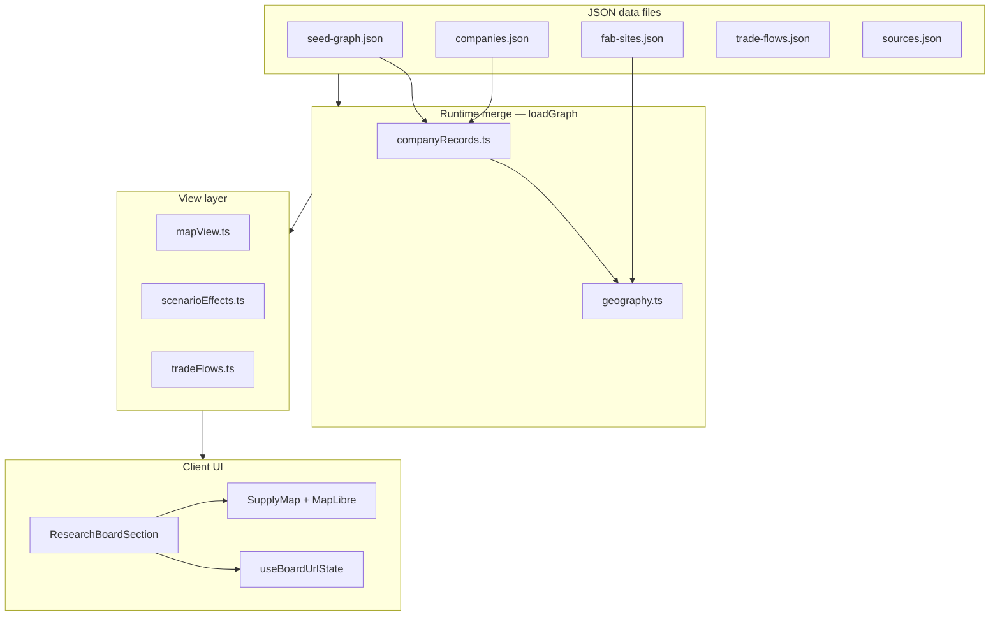

# Chip Sense

**An interactive research board for the semiconductor supply chain** — companies, fabs, typed relationship arcs, trade flows, and illustrative stress scenarios on a world map.

**Live demo:** [chip-sense-ten.vercel.app](https://chip-sense-ten.vercel.app)

Chip Sense is a static [Next.js](https://nextjs.org/) app with **no backend, database, or auth**. All graph data lives in JSON files, is merged at build/request time, and renders entirely in the browser with [MapLibre GL](https://maplibre.org/) via [react-map-gl](https://visgl.github.io/react-map-gl/).

Use it to explore how equipment vendors, foundries, memory makers, packaging houses, and assemblers connect across geography — and how different *illustrative* scenarios restyle those connections for teaching and writing.

---

## Open educational resource

Chip Sense is a **free, open educational resource**. You may use, fork, cite, and share it for teaching, essays, research, and YouTube-style walkthroughs at no charge.

| You may | Please don’t |
| --- | --- |
| Run the live demo or self-host the repo | Present scenarios as forecasts or market advice |
| Cite the project and its source catalog in writing | Imply company endorsement or partnership |
| Screenshot or screen-record the board (with credit) | Redistribute bulk UN Comtrade extracts via this project |
| Reuse the MIT-licensed application code | Strip license / notice files from substantial copies |

**How to use it well:** start from a shareable URL (filters sync to the query string), keep citations one click away in the selection panel, and treat scenario views as teaching stress tests. For video credits, see [docs/youtube-description.md](./docs/youtube-description.md).

Third-party software and data notices: [NOTICE](./NOTICE). Sourcing rules: [SOURCES.md](./SOURCES.md).

### How to cite

**APA-style**

> Alavi, A. (2026). *Chip Sense* [Computer software]. https://github.com/aminalav/chip-sense

**BibTeX**

```bibtex
@software{alavi_chip_sense_2026,
  author  = {Alavi, Amin},
  title   = {{Chip Sense}},
  year    = {2026},
  url     = {https://github.com/aminalav/chip-sense},
  note    = {Interactive semiconductor supply-chain research board}
}
```

GitHub also exposes citation metadata via [`CITATION.cff`](./CITATION.cff) (“Cite this repository”).

### Development assistance

This project was built with human direction and review, with substantial assistance from [Cursor](https://cursor.com/) (AI coding tools). The live board does **not** call AI models at runtime; all map data is static JSON curated in this repository.

---

## What it does

| Feature | Description |
| --- | --- |
| **Supply chain map** | HQ pins, fab site pins, and colored arcs for foundry supply, equipment, packaging, memory, and assembly |
| **Cited facts** | Click a relationship to see disclosure-backed citations from a curated source catalog |
| **Trade flows** | Optional country-to-country chip trade arcs (UN Comtrade–based values) |
| **Scenarios** | Nine stress-test views (Taiwan disruption, HBM shortage, export controls, …) that change pin/arc styling — not forecasts |
| **Editorial tracks** | Lens pages for memory, CPUs, GPUs, and data centers |
| **Estimate tools** | Yield, export controls, fab capacity, packaging cost, AI cluster demand — editable what-if calculators ([/tools](https://chip-sense-ten.vercel.app/tools)) |
| **Shareable URLs** | Every filter, scenario, and selection syncs to the query string |

**Core supply chain view** (`?essay1=1`) focuses the map on twelve anchor companies and key fabs for teaching and screenshots.

---

## Why it exists

Semiconductor supply chains are discussed constantly in policy and tech journalism, but they are hard to *see*: the same company can be a foundry, a packaging bottleneck, and a trade-flow endpoint at once.

Chip Sense is a **visual reasoning tool**:

1. **Separate structure from stress-testing** — registry facts and graph edges are distinct from scenario styling.
2. **Make relationships typed** — a purple equipment arc and a blue foundry arc mean different things.
3. **Keep citations one click away** — sourced edges link to filings and annual reports, not hand-wavy arrows.
4. **Stay honest about limits** — scenarios restyle the map; estimate tools run teaching formulas with labeled assumptions, not forecasts.

---

## Estimate tools

Five client-side calculators live under [`/tools`](https://chip-sense-ten.vercel.app/tools). Defaults are curated teaching estimates; users can overwrite every input. Outputs stay labeled as estimates (`~`, amber badges, persistent banner).

| Tool | Route | Core formula (see [ESTIMATORS.md](./ESTIMATORS.md)) |
| --- | --- | --- |
| Yield | `/tools/yield` | Poisson / Murphy \(Y(A,D)\) + simplified DPW |
| Export controls | `/tools/export-controls` | Rule-union → stressed companies + severity score |
| Fab capacity | `/tools/fab-capacity` | \(WSPM \times U \times DPW \times Y\) |
| Packaging cost | `/tools/packaging-cost` | Substrate + assembly + test, ÷ package yield |
| AI cluster demand | `/tools/ai-cluster-demand` | Clusters → GPUs → HBM → packages → wafers |

Methodology (formulas + default provenance): [ESTIMATORS.md](./ESTIMATORS.md) · in-app: [/estimators](https://chip-sense-ten.vercel.app/estimators)

---



### Request path

1. **Server pages** call `loadGraph()` and `loadSources()` from JSON in `src/data/`.
2. **`loadGraph()`** merges the seed graph → company registry → geography (fab pins, countries, presence edges).
3. **`ResearchBoardSection`** (client) filters the view with `buildMapView()`, computes scenario styling, and syncs state to the URL.
4. **`SupplyMap`** renders MapLibre markers, relationship arcs, and trade lines. It is dynamically imported with `ssr: false` so MapLibre stays out of the server bundle.

### Three data layers

| Layer | Role |
| --- | --- |
| **Registry** | Sourced company HQ, fab sites, and citation catalog (`companies.json`, `fab-sites.json`, `sources.json`) |
| **Graph** | Nodes, typed edges, and scenario definitions (`seed-graph.json` + runtime merge) |
| **Illustrative** | Scenario assumptions and `affects` styling — map emphasis only, not predictive models |

See **[ARCHITECTURE.md](./ARCHITECTURE.md)** for the full component map, merge order, and extension points.

---

## Tech stack

| Layer | Choice |
| --- | --- |
| Framework | Next.js 15 (App Router, static export-friendly build) |
| UI | React 19, Tailwind CSS 4 |
| Map | MapLibre GL 5 (globe projection), react-map-gl 8, tile-free Natural Earth basemap |
| Data | JSON on disk; Node validation scripts in `scripts/` |
| CI | GitHub Actions — lint, `check:data`, build |

---

## Quick start

```bash
git clone https://github.com/aminalav/chip-sense.git
cd chip-sense
npm install
npm run dev
```

Open [http://localhost:3000](http://localhost:3000).

Before changing data:

```bash
npm run check:data   # validates sources, companies, trade flows, scenarios
npm run build
```

---

## Repository layout

```
src/
├── app/              # Routes: / and /track/[slug]
├── components/       # Map, sidebar panels, board shell
├── data/             # JSON datasets + TypeScript types
├── hooks/            # URL state sync
└── lib/              # Graph merge, scenarios, map filters, export
scripts/              # Validators and Comtrade fetch helper
docs/                 # Essay outlines (research writing, not app docs)
```

---

## Documentation

| Doc | For |
| --- | --- |
| [ARCHITECTURE.md](./ARCHITECTURE.md) | Deep dive: data flow, components, merge order |
| [MAP.md](./MAP.md) | Pin colors, layer toggles, URL parameters |
| [SOURCES.md](./SOURCES.md) | Sourcing rules and citation coverage |
| [ESTIMATORS.md](./ESTIMATORS.md) | Estimate-tool formulas and default provenance |
| [NOTICE](./NOTICE) | Third-party software and data notices |
| [CITATION.cff](./CITATION.cff) | Machine-readable citation metadata |
| [docs/youtube-description.md](./docs/youtube-description.md) | Paste-ready YouTube credits / disclaimer |
| [SCENARIOS.md](./SCENARIOS.md) | Scenario list and assumptions |
| [MAINTAINER.md](./MAINTAINER.md) | Deploy workflow and writing docs (maintainers) |

---

## Example URLs

| View | URL |
| --- | --- |
| Core teaching map | [/?essay1=1&trade=1](https://chip-sense-ten.vercel.app/?essay1=1&trade=1) |
| Taiwan crisis scenario | [/?scenario=taiwan-crisis&node=co-tsmc](https://chip-sense-ten.vercel.app/?scenario=taiwan-crisis&node=co-tsmc) |
| GPU track lens | [/track/gpus](https://chip-sense-ten.vercel.app/track/gpus) |
| HBM shortage (memory layer story) | [/?scenario=hbm-shortage&node=co-sk-hynix](https://chip-sense-ten.vercel.app/?scenario=hbm-shortage&node=co-sk-hynix) |

---

## Disclaimer

Chip Sense is an **educational visualization**. Scenario multipliers and styling are illustrative stress tests, not forecasts. Factual claims on the map should be traced through `sources.json` and the selection panel citations. See the in-app disclaimer on every board view.

---

## License

This project’s **source code** is released under the [MIT License](./LICENSE). See [NOTICE](./NOTICE) for third-party software and data attributions.

That license covers the application code in this repository (TypeScript, React components, scripts, and the structure of the JSON datasets). It does **not** mean the author claims ownership of:

- **Third-party materials** cited in `sources.json` (SEC filings, annual reports, trade statistics, and similar) — those remain under their publishers’ terms.
- **Company names, product names, and trademarks** shown on the map — they belong to their respective owners; the map is for education, not endorsement.
- **Facts about the semiconductor industry** — the board visualizes publicly reported relationships; the MIT license is not a claim of proprietary knowledge about the industry.

Scenario styling and multipliers are illustrative only, not forecasts. See the disclaimer above and [SOURCES.md](./SOURCES.md) for how sourcing works in this repo.
